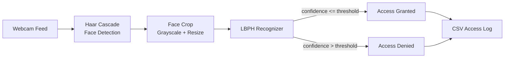

# 🔐 Real-Time Face Recognition Access Control System

A real-time access control system built with **OpenCV**, using **Haar Cascade** for face detection and **LBPH (Local Binary Patterns Histograms)** for face recognition. It watches a live camera feed, identifies enrolled users, and grants or denies access accordingly, while logging every attempt for auditing.


---

## ✨ Features

- 🎥 **Real-time face detection** using OpenCV's Haar Cascade classifier
- 🧠 **Face recognition** with the LBPH algorithm (no deep learning framework required)
- 🧍 **Multi-user enrollment** through a simple CLI command
- ✅ **Grant / deny access logic** driven by a configurable confidence threshold
- 🗂️ **CSV access logs** with timestamp, user name, status, and confidence score
- ⚙️ **Centralized configuration** for camera index, thresholds, and detection parameters
- 🔌 **Hardware-ready hooks** (`grant_access` / `deny_access`) for wiring up a relay, door lock, or buzzer
- 🖥️ **Pure CLI workflow** — register, train, and run, no extra services needed

---

## 🏗️ Architecture



**Pipeline overview:**

1. Each frame from the webcam is converted to grayscale.
2. The Haar Cascade classifier (`haarcascade_frontalface_default.xml`, shipped with OpenCV) detects face regions.
3. Each detected face is cropped, resized, and passed to the LBPH recognizer.
4. The recognizer returns a predicted user ID and a confidence score (lower = better match).
5. If the confidence is within the configured threshold, access is granted; otherwise it is denied.
6. Every decision is written to a CSV log for later review.

---

## 📁 Project Structure

```
face-access-control/
├── data/                  # Captured face samples, one folder per user id
├── models/                # Trained LBPH model and label map
├── logs/                  # CSV access logs
├── src/
│   ├── config.py          # Paths, thresholds, and detection parameters
│   ├── capture_faces.py    # Enrollment: capture and save face samples
│   ├── train_model.py      # Train the LBPH recognizer on saved samples
│   ├── access_control.py   # Real-time recognition and access decision loop
│   └── logger_utils.py     # CSV access logger
├── main.py                # Unified CLI entry point
├── requirements.txt
└── README.md
```

---

## 🚀 Getting Started

### Prerequisites

- Python 3.9 or newer
- A webcam accessible to OpenCV

### Installation

```bash
git clone https://github.com/your-username/face-access-control.git
cd face-access-control
pip install -r requirements.txt
```

### Usage

**1. Enroll a new user**

Captures face samples from the webcam and stores them under `data/<user_id>/`.

```bash
python main.py register "Alice"
```

**2. Train the recognition model**

Trains the LBPH recognizer on every enrolled user and saves the model to `models/trainer.yml`.

```bash
python main.py train
```

**3. Run the access control system**

Opens the webcam feed, detects and recognizes faces in real time, and grants or denies access.

```bash
python main.py run
```

Press `q` at any time to close the camera window.

---

## ⚙️ Configuration

All tunable parameters live in `src/config.py`:

| Parameter | Description | Default |
|---|---|---|
| `CAMERA_INDEX` | Index of the camera device to use | `0` |
| `SAMPLES_PER_USER` | Number of face samples captured per enrollment | `60` |
| `CONFIDENCE_THRESHOLD` | Maximum LBPH distance accepted as a match | `55` |
| `DETECTION_SCALE_FACTOR` | Haar Cascade image pyramid scale factor | `1.1` |
| `DETECTION_MIN_NEIGHBORS` | Minimum neighbors for a valid detection | `5` |
| `DETECTION_MIN_SIZE` | Minimum face size in pixels | `(90, 90)` |

Lowering `CONFIDENCE_THRESHOLD` makes the system stricter (fewer false accepts); raising it makes recognition more lenient.

---

## 📊 Access Logs

Every access attempt is appended to `logs/access_log.csv`:

| timestamp | name | status | confidence |
|---|---|---|---|
| 2026-09-13 10:15:02 | Alice | GRANTED | 41.32 |
| 2026-09-13 10:16:47 | Unknown | DENIED | 78.05 |

---

## 🔌 Extending to Real Hardware

The `grant_access()` and `deny_access()` functions in `src/access_control.py` are intentionally isolated so they can be wired up to real hardware, for example:

- Triggering a relay module to unlock an electric door strike
- Sending an MQTT message to a smart lock
- Raising an alert through a buzzer or notification service

---

## ⚠️ Limitations and Notes

- LBPH is lightweight and works well for small, controlled user sets, but it is less robust than deep-learning-based face recognition under varied lighting, pose, or large user counts.
- Haar Cascade detection can be sensitive to lighting conditions and extreme head angles.
- This project is intended as a learning / portfolio project and a foundation to build on, not a production-grade security system.

---

## 🛠️ Possible Improvements

- Swap the LBPH recognizer for a deep-learning embedding model (for example, a `dlib` or `face_recognition`-based pipeline) for higher accuracy
- Add liveness detection to guard against photo spoofing
- Build a small dashboard to visualize access logs
- Add a REST API layer to control enrollment and monitoring remotely
